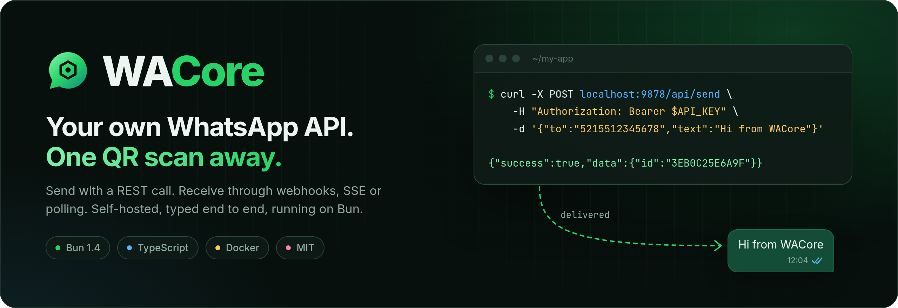
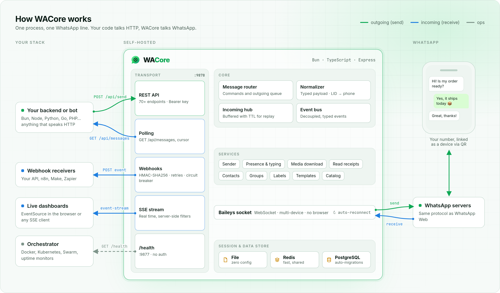

<div align="center">



<br>

[](https://github.com/Pep3M/WACore/actions/workflows/ci.yml)
[](https://github.com/Pep3M/WACore/pkgs/container/wacore)
[](CHANGELOG.md)
[](https://bun.sh)
[](tsconfig.json)
[](LICENSE)

**Self-hosted WhatsApp HTTP API for developers.**<br>
Scan a QR code once, then send messages with a REST call and receive them through webhooks, SSE or polling.

[Quick start](#-quick-start) · [How it works](#-how-it-works) · [API](#-api-at-a-glance) · [Docs](docs/index.md) · [Español](README.es.md)

</div>

---

## Why WACore

You want your app to talk on WhatsApp without adopting a SaaS, paying per message or keeping a headless Chrome alive. WACore runs next to your code, links to your number the same way WhatsApp Web does, and gives you a small, predictable HTTP API.

- **No browser.** It speaks the WhatsApp Web protocol over a WebSocket through [Baileys](https://github.com/WhiskeySockets/Baileys), with no Puppeteer or Chromium. It idles on a fraction of the memory a browser needs.
- **Any language.** If your stack can make an HTTP request, it can send WhatsApp messages. Incoming messages reach you however you prefer: a signed webhook, a live SSE stream or plain polling.
- **Built to stay connected.** Reconnection uses exponential backoff, sessions persist across restarts (File, Redis or PostgreSQL), long network outages recover on their own, and a separate `/health` port serves your orchestrator.
- **Predictable payloads.** Every incoming message is normalized into one typed shape. WhatsApp's internal LIDs are resolved to phone JIDs, so you can always reply to `from`.
- **Tested contract.** More than 770 tests, including contract tests that pin the public routes, auth and payload shapes between releases.

## ⚡ Quick start

### 1. Run it

**With Docker** (recommended):

```bash
docker run -d --name wacore \
  -p 9877:9877 -p 9878:9878 \
  -e API_KEY=change-me \
  -e SESSION_STORE=file \
  -v wacore_data:/data \
  ghcr.io/pep3m/wacore:latest
```

**Or from source** with [Bun](https://bun.sh) ≥ 1.4.2:

```bash
git clone https://github.com/Pep3M/WACore.git && cd WACore
bun install
cp .env.example .env          # set API_KEY=change-me
bun start
```

### 2. Link your number

The QR code is printed in the logs (`docker logs -f wacore`). On your phone, open **WhatsApp → Settings → Linked devices → Link a device** and scan it. The session is saved, so you only do this once.

> You can also fetch the QR as a string from `GET /api/qr` and render it in your own UI.

### 3. Send your first message

```bash
curl -X POST http://localhost:9878/api/send \
  -H "Authorization: Bearer change-me" \
  -H "Content-Type: application/json" \
  -d '{"to":"5215512345678","text":"Hello from WACore 👋"}'
```

```json
{ "success": true, "data": { "id": "3EB0C25E6A9F..." } }
```

### 4. Receive messages

Point WACore at your endpoint and every incoming message arrives as a signed `POST`:

```bash
-e WEBHOOK_URL=https://your-app.com/whatsapp \
-e WEBHOOK_SECRET=a-long-random-string
```

```json
{
  "event": "message",
  "instanceId": "default",
  "timestamp": "2026-09-27T12:00:00.000Z",
  "data": {
    "id": "3EB0C25E6A...",
    "from": "5215512345678@s.whatsapp.net",
    "phone": "5215512345678",
    "pushName": "Juan",
    "type": "text",
    "body": "Hi! Is my order ready?",
    "isGroup": false
  }
}
```

That's the whole loop. The rest of this page covers the details.

## 🧭 How it works

<picture>
  <source media="(prefers-color-scheme: dark)" srcset=".github/assets/architecture-dark.png">
  <source media="(prefers-color-scheme: light)" srcset=".github/assets/architecture-light.png">
  
</picture>

- **One process, one line.** Each WACore instance owns one WhatsApp number. To run several numbers, run several instances, each with its own `WA_INSTANCE_NAME`.
- **Outgoing:** your code calls the REST API (port `9878`). WACore validates the request and sends the message through the Baileys socket. To show "typing…" first, call `POST /api/presence`.
- **Incoming:** WACore normalizes each WhatsApp event into one payload and fans it out to every channel you enable: webhooks, SSE and polling.
- **State:** credentials and keys live in the session store you pick. PostgreSQL also stores contacts, labels and templates, and runs its migrations on startup.

## 📥 Receiving messages

Pick the channel that fits your stack. You can enable several at once.

| Channel | Best for | How |
|---|---|---|
| **Webhook** | Backends, serverless, n8n, Make, Zapier | `WEBHOOK_URL` + `WEBHOOK_SECRET`. Retries and a circuit breaker are built in. |
| **SSE** | Live dashboards, long-running workers | `GET /api/messages/stream`, with server-side filters by type, phone and groups |
| **Polling** | Cron jobs and the simplest setups | `GET /api/messages?since=<cursor>` |

<details>
<summary><b>Verify the webhook signature (TypeScript)</b></summary>

Each webhook carries `X-WACore-Signature`, the hex HMAC-SHA256 of the raw body keyed with `WEBHOOK_SECRET`.

```ts
import { createHmac, timingSafeEqual } from "node:crypto";

export function isFromWACore(rawBody: string, signature: string, secret: string) {
  const expected = createHmac("sha256", secret).update(rawBody).digest("hex");
  return signature.length === expected.length &&
    timingSafeEqual(Buffer.from(signature), Buffer.from(expected));
}
```

</details>

<details>
<summary><b>Auto-reply over SSE (JavaScript)</b></summary>

```js
const API = "http://localhost:9878";
const KEY = "change-me";

// EventSource can't send headers, so the key goes in the query string
const events = new EventSource(`${API}/api/messages/stream?types=text&api_key=${KEY}`);

events.addEventListener("text", async ({ data }) => {
  const msg = JSON.parse(data);
  if (msg.body?.toLowerCase() === "ping") {
    await fetch(`${API}/api/send`, {
      method: "POST",
      headers: { Authorization: `Bearer ${KEY}`, "Content-Type": "application/json" },
      body: JSON.stringify({ to: msg.from, text: "pong 🏓" }), // always reply to `from`
    });
  }
});
```

</details>

<details>
<summary><b>Send from Python</b></summary>

```python
import requests

requests.post(
    "http://localhost:9878/api/send",
    headers={"Authorization": "Bearer change-me"},
    json={"to": "5215512345678", "text": "Your order has shipped 📦"},
)
```

</details>

Full payload reference and event types: [`docs/message-reception.md`](docs/message-reception.md).

## 🧩 API at a glance

All `/api/*` routes need `Authorization: Bearer <API_KEY>` (or `?api_key=` for EventSource).

| Area | Endpoints |
|---|---|
| **Send** | `POST /api/send` (text, replies) · `send-media` · `send-ptt` (voice notes) · `send-sticker` · `send-location` · `send-contact` · `send-event` · `send-product` · `forward` |
| **Interactive** *(opt-in)* | `POST /api/send-buttons` · `send-list` |
| **Messages** | edit `PATCH` · delete for everyone `DELETE` · react · pin · mark as read · download media |
| **Receive** | `GET /api/messages` (polling) · `GET /api/messages/stream` (SSE) · webhooks |
| **Presence** | typing / recording indicators · subscribe to a contact's presence |
| **Contacts** | per-line address book · `POST /api/contacts/check` (who has WhatsApp) · resync |
| **Groups** | create, participants, subject, description, settings, invite links |
| **Chats** | archive, pin, mute, block, delete |
| **Profile & more** | own profile and picture · labels · local message templates · product catalog |
| **Session** | `GET /api/status` · `GET /api/qr` · `POST /api/connect` · `DELETE /api/session` · `GET /health` (port 9877) |

Request and response shapes for every route: [`docs/api-rest.md`](docs/api-rest.md).

## ⚙️ Configuration

Everything is set through environment variables. These are the ones you'll touch first:

| Variable | Default | What it does |
|---|---|---|
| `API_KEY` | — | Bearer token for the API. **If it's unset, the API stays disabled.** |
| `SESSION_STORE` | `postgres` | Where the session lives: `file`, `redis` or `postgres` |
| `DATABASE_URL` | — | PostgreSQL connection string (with `SESSION_STORE=postgres`) |
| `REDIS_URL` | `redis://localhost:6379` | Redis connection string (with `SESSION_STORE=redis`) |
| `WEBHOOK_URL` | — | Where to `POST` incoming events |
| `WEBHOOK_SECRET` | — | HMAC key for the `X-WACore-Signature` header |
| `WEBHOOK_EVENTS` | `message` | Which events to send: `message`, `message.edit`, `message.status`, `presence`, `call`, `connection`, `qr`, `media.downloaded`, `history` |
| `WA_INSTANCE_NAME` | `default` | Name of this line; it's the session key in the store |

All variables: [`docs/env-vars.md`](docs/env-vars.md) · Example file: [`.env.example`](.env.example)

## 🚀 Production

```bash
docker compose up -d   # WACore + PostgreSQL + Redis
```

- **Persistence:** use `SESSION_STORE=postgres` or `redis` in production, or mount a volume on `/data` with `file`. Losing the session means scanning the QR again.
- **Health:** `GET /health` on port `9877` needs no auth and returns `healthy`, `degraded` or `unhealthy`. The image ships with a Docker `HEALTHCHECK`.
- **Security:** keep port `9878` private or behind a reverse proxy with TLS. Use a long random `API_KEY`, and check `X-WACore-Signature` on every webhook.
- **Images:** every `vX.Y.Z` tag publishes `ghcr.io/pep3m/wacore:X.Y.Z` and `latest`. In production, pin a version.

More: [Docker](docs/docker.md) · [Session persistence](docs/session-persistence.md) · [Health check](docs/health-check.md) · [Connection & QR](docs/whatsapp-connection.md)

## 🛠 Development

```bash
bun install
bun run dev      # watch mode
bun test         # 770+ tests
```

The `front/` folder has a small React dev panel (QR, status, live messages, sending). Run it with `docker compose -f docker-compose.dev.yml up`.

Contributions are welcome. Start with [CONTRIBUTING.md](CONTRIBUTING.md).

## ⚠️ Disclaimer

WACore is an independent open-source project. It is **not affiliated with, endorsed by or sponsored by WhatsApp or Meta**. "WhatsApp" is a trademark of WhatsApp LLC.

WACore connects through the multi-device protocol that WhatsApp Web uses. It is not the official [WhatsApp Business Platform](https://business.whatsapp.com/products/business-platform). Unofficial clients may go against WhatsApp's Terms of Service, and numbers that send spam or bulk unsolicited messages get banned. Use it for legitimate conversations with people who expect to hear from you, and at your own risk.

## 📄 License

[MIT](LICENSE) © Pepe Marquez

<div align="center">
<br>
<sub>If WACore saves you time, a ⭐ helps other developers find it.</sub>
</div>
